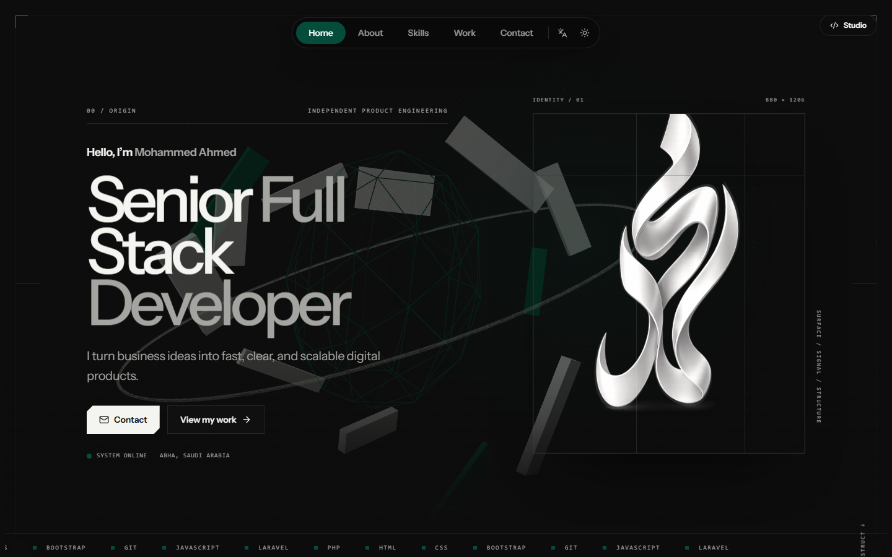

<div align="center">
  

  <h1>Mohammed Ahmed Portfolio</h1>

  <p>
    A cinematic, bilingual portfolio and the private studio that powers it.<br>
    Built for polished storytelling, practical content management, and measurable growth.
  </p>

  <p>
    <a href="https://mohammedahmed.laravel.cloud/"><strong>View the live portfolio</strong></a>
    ·
    <a href="#portfolio-studio">Explore the studio</a>
    ·
    <a href="#local-development">Run it locally</a>
  </p>

  <p>
    
    
    
    
    
    
  </p>
</div>



## More than a static portfolio

The public experience and its administration tools are part of one Laravel application. Content, appearance, analytics, email, team access, and marketing integrations are managed from the private studio and published to the portfolio.

| Public portfolio | Private studio |
| --- | --- |
| English and Arabic content | Profile and availability management |
| Responsive light and dark themes | Projects, skills, categories, and experience CRUD |
| Separate accents per color mode | Visitor, session, page-view, and engagement analytics |
| Optional glass effects | Contact inbox and configurable email templates |
| Interactive Three.js, OGL, and GSAP visuals | Team roles and secure email invitations |
| Installable PWA with offline support | Passkeys, two-factor authentication, and recovery codes |

## Portfolio studio

### Content that stays editable

Manage the profile, work, experience, skills, categories, contact details, resume, availability, and bilingual copy without changing source code. Uploaded media can use local storage or an S3-compatible object store.

### Analytics and integrations

The dashboard includes first-party visitor analytics and an 11-connector integration library. Supported destinations include Google Tag, Google Ads, Google Tag Manager, Search Console, Meta Pixel, TikTok Pixel, LinkedIn Insight Tag, X Pixel, Snapchat Pixel, Pinterest Tag, and Microsoft Clarity.

Each integration can be installed from a validated provider ID or approved custom markup, enabled or paused independently, and checked with the provider's diagnostic tools.

### Contact and collaboration

Contact submissions are stored in the studio, shown in a focused message viewer, and delivered through configurable notification and auto-reply templates. Role-based team invitations use expiring signed tokens and email delivery.

## Technology

| Layer | Stack |
| --- | --- |
| Backend | PHP, Laravel 13, Fortify, Eloquent |
| Application bridge | Inertia.js 3, Wayfinder |
| Frontend | React 19, TypeScript, Vite 8 |
| Interface | Tailwind CSS 4, Radix UI, Lucide |
| Motion and 3D | GSAP, Three.js, OGL |
| Authentication | Passwords, email verification, 2FA, passkeys |
| Quality | Pest, PHPStan, Pint, Rector, ESLint, Prettier |
| Production | Laravel Cloud, S3-compatible object storage |

## Local development

### Requirements

- PHP 8.3 or newer
- Composer
- Node.js and npm
- SQLite, MySQL, or PostgreSQL

### Start the application

```bash
git clone https://github.com/mo7ammedahmed/portfolio-2.git
cd portfolio-2
composer setup
composer dev
```

The setup command installs PHP and JavaScript dependencies, creates `.env`, generates the application key, runs migrations, and builds the frontend.

### Run the quality gates

```bash
composer test
npm run build
```

## Configuration

Environment-specific credentials belong in `.env` locally and in the hosting platform's secret manager in production. The repository includes safe defaults in `.env.example` for database, mail, queue, cache, and filesystem configuration.

Never commit SMTP credentials, API keys, tracking secrets, or production environment values.

---

<div align="center">
  <p>Designed and engineered by <a href="https://github.com/mo7ammedahmed">Mohammed Ahmed</a>.</p>
  <a href="https://mohammedahmed.laravel.cloud/">Portfolio</a>
  ·
  <a href="https://github.com/mo7ammedahmed/portfolio-2/issues">Issues</a>
</div>
